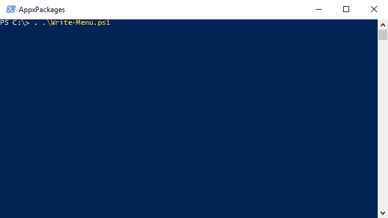

# Write-Menu

### -Title 'AppxPackages' -Sort -Entries (Get-AppxPackages).Name

### -Title 'AppxPackages' -Sort -MultiSelect -Entries (Get-AppxPackages).Name

_NOTE: The last screengrab is missing some frames due to editing, which is why it seems to returns more packages than selected/checked..._

## Description

Outputs a command-line menu which can be navigated using the keyboard. Automatically creates multiple pages if the entries cannot fit on screen.

## Parameters

|  | Parameter | Example |
|:--|:--|:--|
| Required | Entries (array) | `-Entries @('Entry 1', 'Entry 2', 'Entry 3')` |
|          | Entries (hashtable) | `-Entries @{'Entry 1' = 'Write-Host "Command 1"'; 'Entry 2' = 'Write-Host "Command 2"'; 'Entry 3' = 'Write-Host "Command 3'"}` |
| Optional | Title | `-Title 'Example Title'` |
| Optional | Sort | `-Sort` |
| Optional | MultiSelect | `-MultiSelect`

## Controls

| Key | Description |
|:--|:--|
| <kbd>Up</kbd> | Previous entry |
| <kbd>Down</kbd> | Next entry |
| <kbd>Left</kbd> / <kbd>PageUp</kbd> | Previous page|
| <kbd>Right</kbd> / <kbd>PageDown</kbd> | Next page |
| <kbd>Home</kbd> | Jump to top |
| <kbd>End</kbd> | Jump to bottom |
| <kbd>Space</kbd> | Check selection (-MultiSelect only) |
| <kbd>Enter</kbd> | Confirm selection |
| <kbd>Esc</kbd> / <kbd>Backspace</kbd> | Exit |

## Examples

| | Description |
| :-- | :-- |
| [AppxPackages](Examples/AppxPackages.md) | Uses Write-Menu to list app packages (Windows Store/Modern Apps) |
| [CustomMenu](Examples/CustomMenu.md) | Generates a custom menu by manually specifying each entry |
